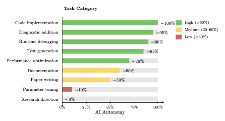

# Anjor Kanekar

I help companies build elite technical organizations through hiring systems design and FDE-style organizational structure.

I write about what actually works in hiring—based on 7 years at Palantir, 1,000+ interviews, and building teams at Protocol Labs and multiple startups.

Recently completed research on AI-assisted physics: AI amplifies expertise rather than replacing it. The effectiveness follows an autonomy gradient—from ~100% for code implementation to ~0% for research direction.

**Featured in [The Pragmatic Engineer](https://newsletter.pragmaticengineer.com/p/forward-deployed-engineers)** on implementing Forward Deployed Engineering.

---

## Popular Writing

### Hiring & Organizations
- **[The Unreasonable Effectiveness of Hiring Assholes](./writing/posts/hiring-assholes.md)** — Why conviction and ego are separate traits
- **[Comand AI: A Hiring Case Study](./writing/posts/comand-ai.md)** — How we designed hiring for mission-driven engineers
- **[Context Matters: Hiring is Not Fungible](./writing/posts/context-matters.md)** — Why generic hiring processes fail
- **[Case Study: Building a Hiring Process for Northslope](./writing/posts/smart-win.md)** — Defining cultural traits vs role competencies

### AI Research & Validation

{ width="700" }

- **[The Autonomy Gradient](./writing/posts/autonomy-gradient.md)** — What AI can and can't do in physics research
- **[Physics-Oracle Validation](./writing/posts/physics-oracle-validation.md)** — How to trust code you've never read
- **[Writing a Physics Paper with Claude](./writing/posts/writing-gandalf-paper.md)** — Workflow, iterations, and hallucinations caught in review

[All writing →](writing/index.md)

---

## About Me

PhD in Computational Physics. 7 years at Palantir as a Forward Deployed Engineer and hiring manager. Built engineering teams at Protocol Labs (onboarding 2+ petabytes to Filecoin) and Radiant AI.

I've conducted over 1,000 technical interviews and trained hundreds of interviewers. I built hiring systems that scaled from seed-stage startups to established companies.

Now I help ambitious companies build hiring systems that actually work and structure their engineering organizations around customer outcomes.

I recently completed rebuilding my plasma physics simulations with AI assistance—validating that AI amplifies expertise rather than replacing it. The paper is available on [GitHub](https://github.com/anjor/gandalf-paper) along with the [code](https://github.com/anjor/gandalf).

---

## Work With Me

I help companies build elite technical organizations across four key areas:

**Hiring & Talent Systems** — Design hiring processes, provide interview capacity, lead hiring functions

**FDE & Organizational Strategy** — Build Palantir-style forward deployed engineering teams and operating models

**AI Strategy & Adoption** — Guide AI implementation, validate AI capabilities, advise on AI-assisted workflows

**Palantir Ecosystem** — Technical strategy, FDE hiring, platform implementation expertise

[See full services & case studies →](hire.md)

**Quick start:** Email me at me@anjor.xyz
