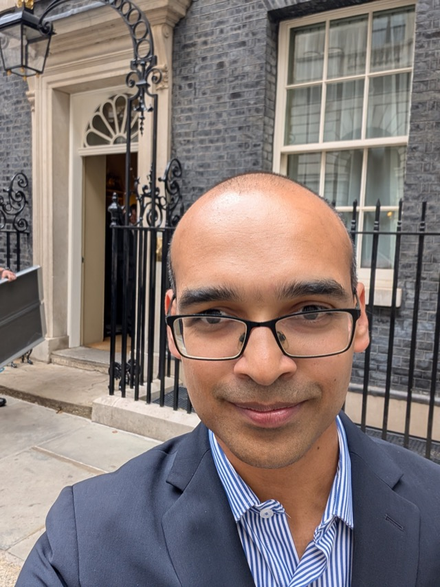

# Anjor Kanekar

{ align=right width="260" }

I'm a computational physicist turned Forward Deployed Engineer. I spent 7 years at Palantir building and hiring FDE teams, and I write here about how that role actually works — and about doing real physics research again, this time with AI.

---

## About Me

PhD in Computational Physics from the University of Maryland. I spent 7 years at Palantir as a Forward Deployed Engineer and hiring manager, conducted over 1,000 technical interviews, and trained hundreds of interviewers. Featured in [The Pragmatic Engineer](https://newsletter.pragmaticengineer.com/p/forward-deployed-engineers) on how FDE organizations work.

I recently rebuilt my plasma physics simulations with AI assistance and took them all the way to a publishable result — validating that AI amplifies expertise rather than replacing it. The paper is on [GitHub](https://github.com/anjor/gandalf-paper) along with the [code](https://github.com/anjor/gandalf). More on the [research page](research/index.md).

---

## Writing

### Forward Deployed Engineering
The role is having a moment, and most of what's written about it is muddled. My running attempt to pin it down — what it is and the strategic fork AI has opened up — lives on the [FDE page](fde/index.md).

- **[If LEGO Had Forward Deployed Engineers](./writing/posts/lego-fde.md)** — What actually makes an FDE different from a really good consultant
- **[The FDE Fork: Platform or Outcomes](./writing/posts/fde-fork.md)** — The strategic choice founders don't realise they're making
- **[The FDE Manifesto](./writing/posts/fde-manifesto.md)** — What the role is for, and why most companies get it wrong

### AI + Physics Research

{ width="700" }

- **[AI as the Undergrad Researcher](./writing/posts/ai-undergrad-researcher.md)** — A real physics result, two months, one person
- **[The Autonomy Gradient](./writing/posts/autonomy-gradient.md)** — What AI can and can't do in physics research
- **[Writing a Physics Paper with Claude](./writing/posts/writing-gandalf-paper.md)** — Workflow, iterations, and hallucinations caught in review

### Hiring & Organizations
- **[The Unreasonable Effectiveness of Hiring Assholes](./writing/posts/hiring-assholes.md)** — Why conviction and ego are separate traits
- **[Context Matters: Hiring is Not Fungible](./writing/posts/context-matters.md)** — Why generic hiring processes fail
- **[Comand AI: A Hiring Case Study](./writing/posts/comand-ai.md)** — How we designed hiring for mission-driven engineers

[All writing →](writing/index.md)

---

## Work With Me

I run [Platypus Technologies](https://platypustech.xyz), where I help companies build and run Forward Deployed Engineering functions. If you want to work with me, that's the place to go.
