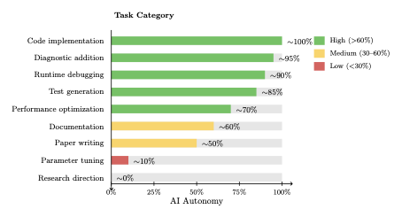

# Anjor Kanekar

I'm the founder of [Platypus Technologies](https://platypustech.xyz), where I help companies build Forward Deployed Engineering functions.

---

## About Me

PhD in Computational Physics from the University of Maryland. I spent 7 years at Palantir as a Forward Deployed Engineer and hiring manager, conducted over 1,000 technical interviews, and trained hundreds of interviewers. Featured in [The Pragmatic Engineer](https://newsletter.pragmaticengineer.com/p/forward-deployed-engineers) on how FDE organizations work.

I recently rebuilt my plasma physics simulations with AI assistance — validating that AI amplifies expertise rather than replacing it. The paper is on [GitHub](https://github.com/anjor/gandalf-paper) along with the [code](https://github.com/anjor/gandalf).

---

## Popular Writing

### Hiring & Organizations
- **[The Unreasonable Effectiveness of Hiring Assholes](./writing/posts/hiring-assholes.md)** — Why conviction and ego are separate traits
- **[Comand AI: A Hiring Case Study](./writing/posts/comand-ai.md)** — How we designed hiring for mission-driven engineers
- **[Context Matters: Hiring is Not Fungible](./writing/posts/context-matters.md)** — Why generic hiring processes fail
- **[Case Study: Building a Hiring Process for Northslope](./writing/posts/smart-win.md)** — Defining cultural traits vs role competencies
- **[FDE Advisory Materials](https://anjor.github.io/fde-advisory-materials/)** — Complete guide to building Forward Deployed Engineering teams

### AI Research & Validation

{ width="700" }

- **[The Autonomy Gradient](./writing/posts/autonomy-gradient.md)** — What AI can and can't do in physics research
- **[Physics-Oracle Validation](./writing/posts/physics-oracle-validation.md)** — How to trust code you've never read
- **[Writing a Physics Paper with Claude](./writing/posts/writing-gandalf-paper.md)** — Workflow, iterations, and hallucinations caught in review

[All writing →](writing/index.md)

---

## Work With Me

I run [Platypus Technologies](https://platypustech.xyz), where I help companies build and run Forward Deployed Engineering functions — from hiring the team to embedding as a fractional technical leader.

If you're building an FDE function or thinking about it, [let's talk](mailto:work@platypustech.xyz).
