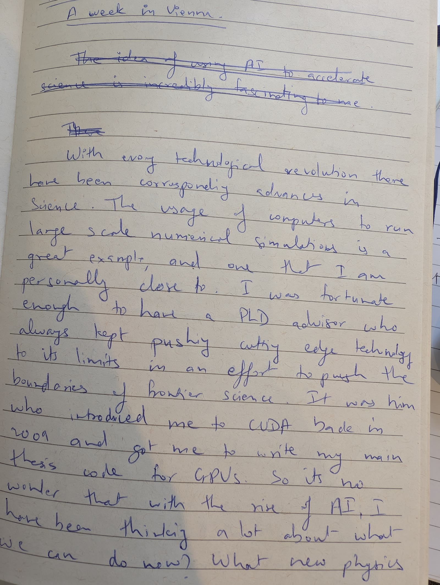
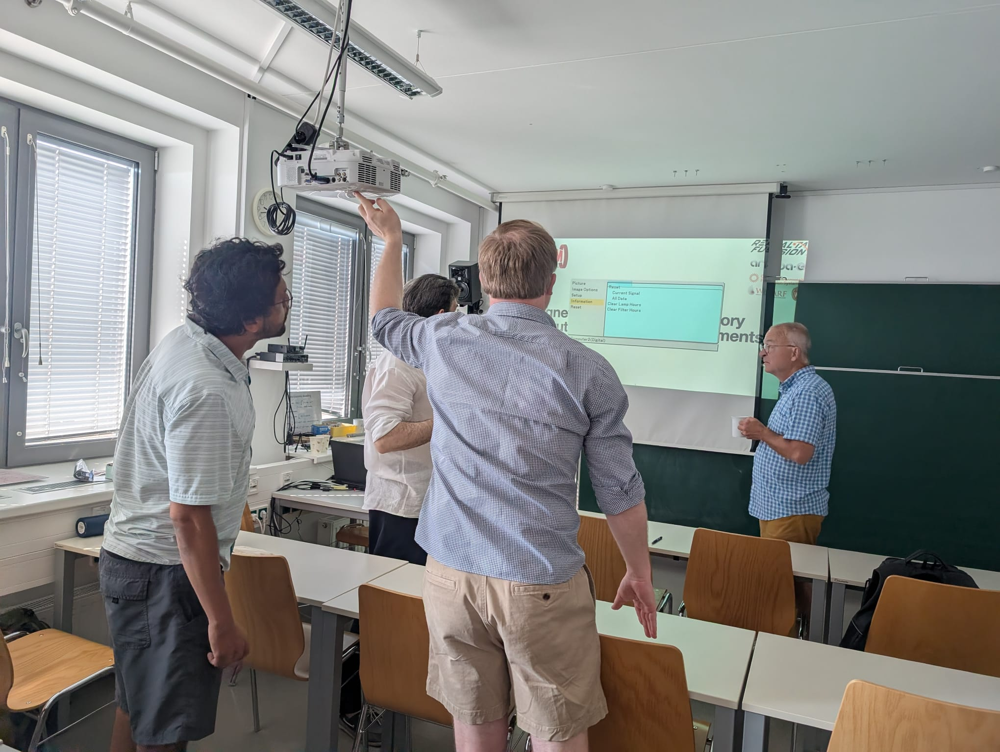
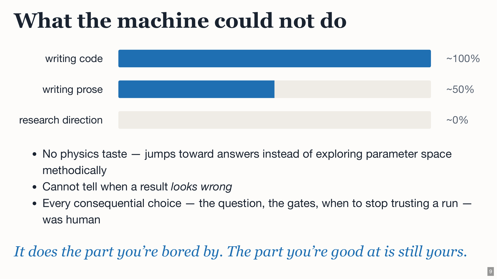

# A week in Vienna

Twelve years after I last attended the [Plasma Kinetics Working Meeting in Vienna](https://www-thphys.physics.ox.ac.uk/research/plasma/wpi/workshop2026.html), I returned expecting—perhaps a little too confidently—to be the AI expert in the room, only to be humbled within the span of a week.

{: width="70%" }

*The first draft of this article, written by hand.*

Technological revolutions have often reshaped science. The use of computers to run large-scale numerical simulations is an example I am personally close to. I was fortunate enough to have [Bill Dorland](https://en.wikipedia.org/wiki/Bill_Dorland) as my PhD advisor. He was always pushing cutting-edge technology to its limits in an effort to expand the boundaries of science. He introduced me to CUDA back in 2009 and encouraged me to write the main code for my thesis to run on GPUs. So, with the rise of AI, I have been thinking a lot about what might now be possible. What new physics problems can we tackle? How does AI change the way we do physics?

Those questions sent me down a path last year of [rewriting GANDALF](https://github.com/anjor/gandalf) and attempting a return to physics after a hiatus of more than a decade. The timing was fortunate: AI models were going through an inflection point, with a sudden improvement in their abilities, particularly in coding. As I made progress, I reached out to members of my former research group to show them what I had done and crowdsource ideas for future work.

Science is paradoxically both lonely and collaborative. You have to put in a non-trivial amount of individual effort, but you also have to talk to other people and share ideas. One without the other doesn't work. Those conversations led to an invitation back to the Vienna meeting for the first time in 12 years.

The Vienna meeting has always been unusually well organised. It is a working meeting where the expectation is that you make real progress during the one or two weeks you attend. The number of talks is deliberately kept to a minimum, and speakers are warned that their time is capped at 30 minutes. Interruptions and discussions—even during the talks—are encouraged, leaving most of the week for collaboration. Each week also has dedicated themes to give the work some focus.

*Before the physics could begin: several physicists versus one projector.*

I attended week two, which had two themes I was interested in: phase-space frolics, my previous research area, and AI as a research assistant, my new obsession.

This group includes some of the smartest people I know. It is a place where curiosity and original thought are valued, and I was quickly forced to recognise how narrow my own conception of AI in physics had been. I had focused mainly on computational physicists: using AI to write better codes faster, orchestrate large numbers of simulations, perform comprehensive data analysis, and produce presentations. I saw it as an assistant that could do the boring work a physicist has to get through before reaching the interesting work.

*My view going into the meeting: AI could do the work around the physics, but not choose the direction.*

There were sceptics in the room, some of whom I managed to turn around and for whom this was exactly the right pitch. What fascinated me, however, was seeing physicists use AI for analytical calculations and mathematical reasoning. I had not realised that current models were capable of being useful in that kind of work.

We had all sorts in the room. At one end were the completely AI-pilled, pushing Claude and ChatGPT to find new gyrokinetic invariants. At the other was a hardcore programmer who struggled to cede control to Claude Code, but who, after an afternoon of seeing what was possible, found himself frustrated by the rate limits. There were also cynics who had tried something six months ago, found that it did not work, and given up without appreciating how rapidly the technology was improving.

Some started using AI more in their work and personal lives over the course of the week; others remained unconvinced. But even among the sceptics, there was a sense that the technology is here to stay and has the potential to change how we work.

I arrived in Vienna thinking that AI's role in physics was largely to remove the computational drudgery surrounding the interesting work. I left wondering whether it might also become part of the reasoning itself. I don't yet know where that leads, but I am energised by the possibilities. 

In the coming months, I hope to carve out more time for independent physics research and find out.
