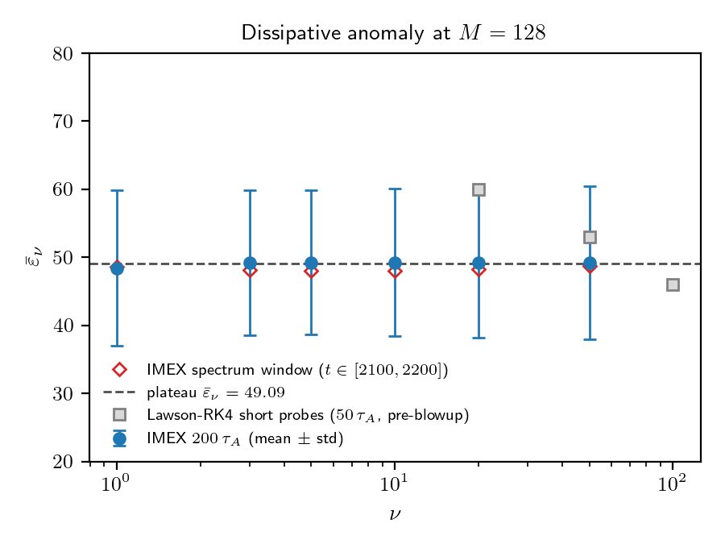
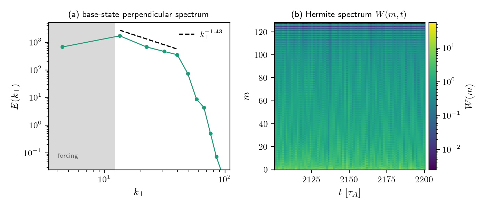
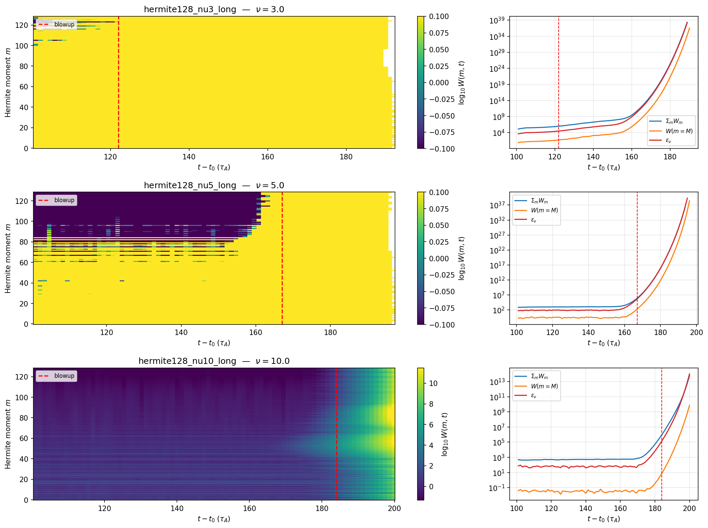

# AI as the Undergrad Researcher: A Real Physics Result, Two Months, One Person

Writing code with AI is no longer surprising. I rebuilt my PhD-era gyrokinetics code in JAX with Claude in 30 days last year ([Building a Gyrokinetics Code Without Reading a Single Line](./building-gandalf.md)). What I actually wanted to test was the next step: can AI do the unglamorous, undergraduate-level research motions that turn a working tool into a publishable result — running simulations on a cluster, iterating on the configs when the physics looks off, generating diagnostic plots, catching numerical bugs, and drafting the paper?

Two months later, the answer is yes. The paper is merged ([repo](https://github.com/anjor/krmhd-research), currently with [Alex Schekochihin](https://www-thphys.physics.ox.ac.uk/people/AlexanderSchekochihin/) for review). It's a small but clean physics result: across a 50× scan in collisionality, the phase-space dissipation rate stays flat to under 1%. The kinetic analogue of [Onsager's classical 1949 dissipative anomaly](https://doi.org/10.1007/BF02780991), demonstrated directly in nonlinear KRMHD simulation.

In this article I write about what those two months actually looked like — what Claude did, where I stepped in, and the broader claim I want to make: computational physics researchers today have undergraduate-level research assistants on tap, and using them well is a systems problem more than a model problem.

## The Setup

In plasma turbulence, energy cascades from large scales down to small scales until it dissipates. The dissipation rate ε_ν depends on collisionality ν. [Onsager's 1949 result](https://doi.org/10.1007/BF02780991) for incompressible fluids (the *dissipative anomaly*, sometimes called Onsager's conjecture) says ε_ν becomes independent of viscosity in the inviscid limit — the cascade self-organises to maintain constant flux. The kinetic analogue of this statement has been argued for in the literature (Schekochihin 2016, Adkins 2018, Eyink 2018, Nastac 2024) but hadn't been directly demonstrated in nonlinear KRMHD simulation. That was the question: can we see the ν-independent plateau?

The reason to pick this question was pragmatic. The setup is tractable, all you need is one diagnostic per run. If the simulations behaved, the result would be unambiguous. Checking the validity of the results was easy.

**Figure 1**: The collisional dissipation rate ε_ν stays flat to under 1% across a 50× scan in collisionality ν. This plateau is the central result of the paper.

**Figure 2**: What a healthy run looks like (ν=3). Left: the time-averaged perpendicular spectrum E(k_⊥) shows a clean inertial-range cascade. Right: the Hermite-moment spectrum W(m,t) as a heatmap — energy stays confined to low m, with no pileup at the m=128 truncation. This is the "physics makes sense" check I was doing on every run.

## The Workflow: Claude Does the Undergrad Work

For two months, almost every day, the rhythm looked like this:

1. I state the next physics goal in a sentence or two.
2. Claude proposes a config — YAML parameters, a Modal runner, sometimes a new diagnostic.
3. I push back on the physics where it looks wrong, or say "go for it."
4. Claude submits the run to A100 cloud GPU.
5. Run finishes, Claude pulls the data and generates plots.
6. I look at the plots and decide whether the physics makes sense.
7. If yes, Claude drafts the paper section. If no, we iterate.

The bulk of the labour — writing the Modal runner, parsing diagnostic outputs, fitting power laws, generating figures, writing LaTeX, managing the BibTeX — was Claude. I never touched the cloud orchestration code. I never wrote a matplotlib script. I never edited the LaTeX preamble. I looked at outputs and either nodded or asked for something different.

As things progressed, we got into a rhythm. A normal day involved me sending 5-10 short messages, mostly along the lines of:

- "go for it"
- "this looks great! Let's get it merged."
- "ok submit the M=256 run too"

This is the texture of the collaboration most of the time: short, direct, advisory messages, the kind you would send a capable grad student.

## Where I Stepped In

The interesting moments are the five places where I had to nudge. None of them were heroic. Each was the kind of intervention an advisor makes when a student is going down the wrong path.

### Nudge 1: Lambda

Two weeks in, the Hermite cascade wasn't cascading. The setup was right by every code-level check, but energy was just sitting in the lowest moment. I asked: *isn't there supposed to be a coupling Λ between g₀ and g₁?* The Alfvénic checkpoint we'd restarted from had Λ=1; for the Hermite problem at β_i=1, it should be √5. One physical constant. The cascade lit up on the next run.

The AI executes correctly inside the frame it is given. The frame — including the specific physical values that distinguish your problem from the adjacent one — is yours to set.

### Nudge 2: Three Weeks Chasing a Numerical Ghost

This was the longest detour, and the one I keep thinking about. Every nonlinear run at high ν blew up. The blowup times scaled with ν cleanly — ν=1 died at 80 τ_A after the restart, ν=3 at 122 τ_A, ν=5 at 167 τ_A — and the scaling matched what the canonical "pileup at the Hermite truncation" failure mode predicts. The literature warns about it. I went deep into that hypothesis.

For three weeks Claude helped me investigate inside that frame: adjusting hyper-collisional dissipation, varying M, looking at high-m energy budgets. The frame was wrong, but it was an *internally consistent* wrong frame, which is what made it so hard. Every diagnostic could be interpreted as consistent with the pileup story if you squinted.

What broke it was finally asking Claude to extract the three diagnostics the pileup story actually predicts: the energy at the truncation moment, the parallel-wavenumber spectrum at the highest m, and how localised the blowup was across m. The pileup story predicted a clear signal in all three, and the data showed none of them. The energy at the truncation sat at the noise floor, the k_z spectrum at high m was down at 10⁻¹⁴, and the blowup happened simultaneously across every moment, independent of ν. That is not a physical cascade failing; that is the time integrator.

**Figure 3**: What the wrong story looked like. W(m,t) heatmaps for the runs that blew up, with the divergence in ΣW(m), W(m=M), and ε_ν(t) on the right. It reads as a physical pileup at the truncation, but it was actually a hidden CFL leak in the Lawson-RK4 integrator. The wrong frame produced fingerprints that looked entirely physical.

I reframed for Claude: *this isn't a physics bug, it's a code-path bug. Look at the Lawson-RK4 integrator.* Within an afternoon Claude had identified a hidden CFL leak in the integrator. A fix shipped as GANDALF #138 the next day. 

The honest version is that the AI did not catch this. It spent three weeks helping me debug inside a confidently wrong hypothesis. What broke the frame was me coming back to first principles and asking "what would the data look like if I were wrong?" before "what would the data look like if I were right?"

This is the hardest discipline to maintain in a long project. The frame is yours to set, and questioning it is yours too.

### Nudge 3: Dropping the Π(m) Panel

Late in the project Claude proposed a second panel for Figure 1 showing the constant-flux Hermite cascade, Π(m) versus m. The diagnostic worked and the figure was real, but the ν=1 curve had a clear numerical artifact left over from low-ν pileup. Claude was happy to keep the panel with explanatory caveats. My message at the time was: *hmmm the flux plot is not great honestly. i think we should just remove it.* The figure that survived was cleaner, and the headline result stronger.

The instinct to publish less rather than over-claim is a human one. The AI will defend a marginal figure indefinitely if you let it.

### Nudge 4: Checking the Novelty Claim

The draft asserted that no prior numerical work had cleanly demonstrated a ν-independent ε_ν. I have been out of active physics for over a decade, so I am not current on the literature and couldn't vouch for that claim. What I could do was flag it. I asked Claude whether we actually had a citation for the sentence.

Claude pulled the relevant prior work, including Nastac 2024 — titled "Phase-space entropy cascade and dissipative anomaly," recent, directly adjacent to our claim, and a paper I had never seen. We turned the bare assertion into a short prior-work paragraph and cited it properly.

This nudge cuts the other way from the rest. Here the AI knew the literature better than I did. My contribution was the editorial reflex of not asserting novelty I hadn't checked; the retrieval was Claude's. The lesson is to interrogate your own strong claims and let the AI do the literature work it is genuinely good at.

### Nudge 5: The Convergence Study

This is the least dramatic of the five, included because it is the routine mode. Late in the project I said: *we should do the M convergence as a part of this study.* Claude wrote the Modal runner, submitted two new sims (M=64 and M=256 at ν=3), did the analysis, and wrote the new subsection. The whole thing took two days, with almost no input from me beyond approving the configs. Most of the collaboration looks like this. The dramatic episodes are easy to write about, but the long calm stretches where the work just gets done are the actual story.

## Memory: The New Piece of Infrastructure

For the GANDALF sprint, persistent memory didn't matter. It was thirty days in one rhythm, and the whole project fit in active context.

For this project it did matter. At sixty days you can't hold everything in working memory, because sessions interrupt each other and knowledge from Tuesday gets lost by Thursday unless you write it down. The auto-memory system in Claude Code — files that persist across sessions — turned out to be the most important piece of infrastructure for the long arc.

There are six memory files for this project right now. Two of them, verbatim:

> **Lambda parameter physics**
> Lambda=1 kills Hermite cascade; use √5 for standard β_i=1

> **M=128 Hermite — resolved by GANDALF v0.5.0 IMEX**
> Lawson blowup was numerical; pin scheme="imex_rk222"; ν=3 acceptance passed

These are corrections I won't have to relearn three weeks later. The "I already explained this to you" cost is the silent productivity killer in any long-running AI collaboration, and persistent memory is what prevents it.

## It's a Systems Problem

The most important thing I learned from this project is that using AI effectively at the two-month scale is not a model problem but a systems problem.

The model is a given. What mattered was the system *around* the model: persistent memory, the choice of a tractable physics question, Modal as the cloud orchestration layer, a clean cross-repo handoff between [GANDALF](https://github.com/anjor/gandalf) (the upstream library, where bugs got filed) and [krmhd-research](https://github.com/anjor/krmhd-research) (the science repo, where the paper lives), a paper repo with curated BibTeX, the ability to look at a generated plot and decide in seconds.

The [autonomy gradient](./autonomy-gradient.md) framing I wrote about a few months ago — about choosing where on the spectrum from "I drive every step" to "AI runs autonomously" — already feels dated. The model capability has moved faster than the framework was ready for. The real question now isn't "how much autonomy do I give it?" but "what's the system I need around it so that the autonomy is productive?"

By "system" I mean the set of practical questions around the model. Where do corrections persist? Where do artifacts live? What is the cross-tool rhythm? Where do you intervene without breaking flow? What is the smallest unit of trustable output — a plot, a config, a paragraph? And how do you make decision-points cheap enough that you actually make them?

I don't have clean answers. What I have is the working version of one specific instance: a six-memory-file, two-repo, Modal-backed, advisor-mode rhythm that produced a paper. The recommendations below are what I've extracted from it.

## What This Enables: Independent Computational Research

The category I keep thinking about is "recovering physicists" — people who left active research years ago but kept the training and the taste. The cost of returning is now genuinely low. A side project, a few hours a week, can produce real work.

Computational physics researchers today, in my reading, have undergraduate-level research assistants on tap. They are not as good as a great grad student, but they are far better than no help at all: reliable, never tired, comfortable at 2am, and never frustrated when you ask them to redo a figure for the fifth time.

This isn't an "intelligence explosion" claim. The model isn't replacing the PI. What it's replacing is the bottleneck of needing collaborators and students just to make a tractable problem possible to attack. A senior researcher who can recognise good physics and bad physics now has access to a pool of execution labour they didn't have before.

I am over a decade out of an active research role, and I am running a real physics investigation as a side project. That would not have been possible 18 months ago.

## Recommendations for Long-Running AI-Assisted Research

These are opinionated, and some will age badly given how fast the model and the tooling are moving.

1. **Choose a scope you can validate at a glance.** Pick a question where the headline diagnostic is a number or a single curve. If you can't tell instantly whether the result is right, neither can the AI.

2. **Build persistent memory aggressively.** Every hard-won correction goes in, whether it is a specific physical value, an algorithmic gotcha, or something the AI got wrong twice. Re-learning is the dominant hidden cost.

3. **For any result you can't independently verify, ask "what would the data look like if I were wrong?" before "what would the data look like if I were right?"** The Lawson-RK4 misdiagnosis cost three weeks because I never ran the falsifying diagnostic first.

4. **Default to dropping marginal results.** The AI will defend a borderline figure indefinitely. The discipline to publish less is yours.

5. **Interrogate your own novelty claims.** Don't let "no one has done this before" stand on faith, especially if you're not current on the literature. Ask the AI to find the prior work — retrieval is something it does well, particularly if you've had it build up a reading list you can point it back to.

6. **Run experiments on git branches and tell Claude to commit relentlessly.** I leaned on git heavily. A branch lets the AI try a parameter change or a refactor in a sandbox without touching the version that works, and frequent commits turn a bad run into a one-command rollback rather than a reconstruction job. When the AI is generating most of the code and configs, cheap rollback is what lets you give it room to run.

7. **Build the cross-tool rhythm explicitly.** If your work spans multiple repos or services (an upstream library + your project + a cloud compute provider + a paper repo), be explicit about the handoffs. File upstream issues. Plan for context-switching cost.

8. **Treat the AI like the smart undergrad.** Validate through physics outputs, not code review. Don't read the code; look at the plot. If the plot looks right and the diagnostics check out, the code is probably right. If the plot looks wrong, no amount of code reading will tell you why.

9. **Question your framing every 1-2 weeks.** If you've been working inside a hypothesis for two weeks without pushback, force a first-principles review. The AI won't supply that question.

## The Numbers

- Calendar time: ~9 weeks, including the extended detour
- Production runs: 9 (6 in the main ν-scan, 3 in the M-convergence)
- Modal GPU-hours: ~52 (mostly A100, mostly overnight)
- Failed Lawson-RK4 runs along the way: ~12 (the three-week wrong frame cost compute too)
- Memory files created: 6
- Paper: 8 pages, 11 references, 3 figures, 1 results table, 1 convergence table

I don't have a clean dollar figure for Claude API usage on this project — the work spanned Claude Code sessions across multiple repos, various model tiers, and some agentic runs. Honest estimate: small compared to the GPU compute, which itself is small compared to a postdoc-month.

## What's Next

The original [experiment plan](./physics-researcher-ai-intro.md) listed multi-ion turbulent heating as the actual physics target. The dissipative anomaly was a stepping-stone — a question I picked precisely because I could tell at a glance whether the answer was right. The next thing is harder. The physics is less clean, the literature is more contested, and the diagnostics don't reduce to a single number.

The thing I most want to find out is whether the rhythm scales — whether the system holds when the AI doesn't have a clear template from existing literature, when "what's the right plot?" is itself a research question, and when the answer isn't a flat line but something with structure I'll have to interpret. I'll know in a few months.

The intelligence-on-tap claim looks more real than it did a year ago. What I now think is the real constraint is the speed at which you can validate what the AI produces. The AI does the undergraduate work cleanly, and the bottleneck is the advisor looking at the outputs and deciding whether they are right.

---

### Acknowledgements

Alex Schekochihin for reviewing the draft and continuing to point me at the right physics. The Anthropic team for the tools.
