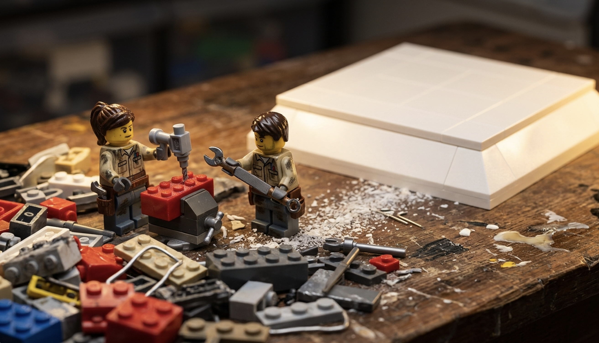
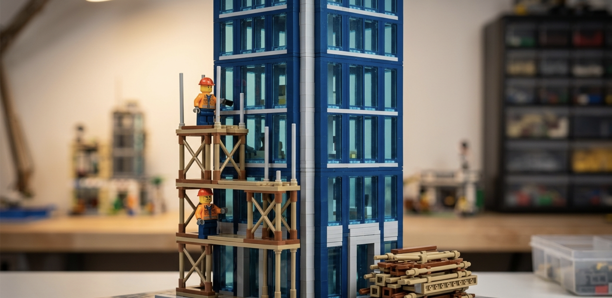
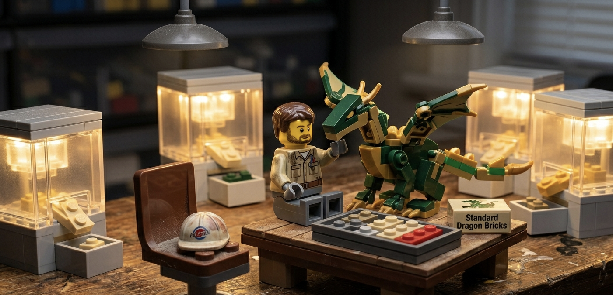
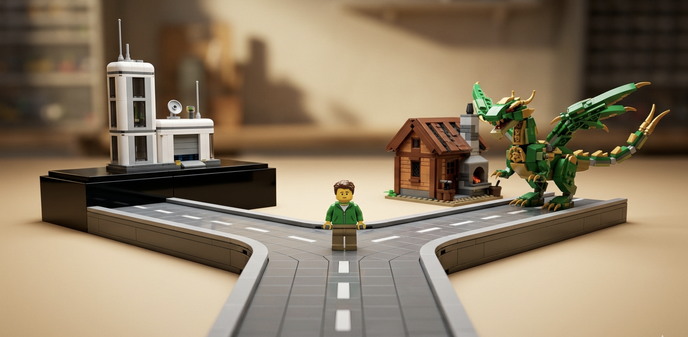

# The FDE Fork: Platform or Outcomes

In *[If LEGO Had Forward Deployed Engineers](./lego-fde.md)*, I ended with a wrinkle I promised to write up properly: AI keeps handing FDEs new bricks, the line between "forward deployed engineer" and "software engineer" is blurring, and at some point you have to ask whether you even need to productise the dragon at all.

This is that piece. It's now a real choice. There are two coherent ways to run a forward deployed company, AI made the second one viable, and a founder who hasn't consciously picked one is going to build a confused org with a confused FDE role. The nature of the FDE role isn't a fixed thing you can look up. It's downstream of a strategic decision most founders don't realise they're making.

## Foundry was an accident

Start with where the role comes from, because the origin explains everything that follows.

Nobody at Palantir sat in a room and decided to build Foundry. Here's how I described it on a call last year:

> The way Foundry as a product actually happened is very interesting. No one said, "Oh, let's build Foundry." It was literally forward deployed engineers working with customers, almost a consulting shop. And the difference between an FDE and a consultant is the alignment: we get paid to *solve* problems, not to spend hours solving them. Given they were engineers, what they would do is build tools to bootstrap themselves — mainly for the data integration piece. And some customers noticed this and said, "If you just license the tools, we'll pay licence fees for them." That's how Foundry happened. A couple of FDEs went away and said, "We're going to take a few months and build Foundry."

So the product and the FDE motion were entangled from day one. The FDEs weren't there to deliver Foundry. They were there to solve customer problems, and Foundry fell out of the residue — the tools they kept rebuilding to make themselves faster. 

That's worth holding onto, because it means the FDE role was never *defined* by the platform. The platform was defined by the FDEs.

## The 2015–2020 thesis: forward deployment in service of a platform

For most of the decade that followed, though, the relationship ran the other way. Once Foundry existed, the FDE motion had a job: feed the platform.

This is the role I described with the LEGO dragon. The customer wants a dragon, there's no brick for the curve of its neck, so the FDE drills holes and glues bricks and builds a Frankenstein scaffold and *then* builds the dragon. The deliverable to the customer is the dragon. The deliverable to your own company is the bag of weird bricks — the custom hacks you walk back to the product team so they can decide what to manufacture. That loop, customer problem → bespoke build → product signal → real product, *was* the whole game. The FDE was a product R&D function dressed up as a delivery function.

And the thing that made that motion sustainable — that justified years of low-margin, labour-heavy services work — was the ambition behind it. Palantir wasn't running a consultancy that happened to write software. It was building the operating system for the world's largest and most important institutions, and the services were the cost of discovering the shape of that operating system. You can't find the shape of a platform from a conference room. You find it by embedding engineers in twenty messy customers and seeing which weird bricks keep showing up.

You can see the platform doing its job in the staffing numbers. Early on, a single use case took something like three to five FDEs. By a few years in, the ratio had inverted — one FDE could carry two or three customers, because the platform had absorbed enough of the weird bricks that each new deployment needed less hand-building. The role was, by design, bending towards its own obsolescence. Every brick you productised was a brick the next FDE didn't have to drill.

That's the tell. In the platform model, a healthy FDE org is one that slowly needs fewer FDEs per dollar. The role is a scaffold. The building is the product.

## What AI changes

Now the wrinkle.

The reason the platform model made sense wasn't just ambition, it was economics. Services scale linearly with headcount and carry consultancy margins. The only way to escape that gravity was to productise — to convert hand-built dragons into licensable bricks so that, eventually, the customer's own engineers build dragons on top of your platform while you collect licence fees. Productisation was the *only* exit from the margin trap.

AI weakens that constraint. When a single engineer with Claude Code, Skills, MCP servers, and a stack of internal agents can build a credible dragon in an afternoon, the cost of bespoke delivery collapses. And once bespoke delivery is cheap enough, you can run a services business at margins that used to require a product.

This is the "AI-powered services" thesis that [Sequoia](https://sequoiacap.com/article/services-the-new-software/) and [YC](https://www.ycombinator.com/rfs#ai-native-service-companies) have been talking about — services companies with software economics. The mechanism is exactly the brick library getting powerful enough that you no longer need to manufacture and sell bricks to make the unit economics work. You just keep the brick-shaping machine *internal*, point your FDEs at it, and sell the dragons.

So a third model becomes available — and notice it's not new, it's the *original* model with the economics fixed. Palantir started as "essentially a consulting shop." The reason it couldn't stay one was margins. AI is, in effect, an offer to remove that reason.

## The fork

Which gives founders a genuine fork. Two coherent strategies, and you have to pick.

**Path A — Platform.** You productise. The FDE is a product scout. The compounding asset is the product, and you sell licences. The bet is that the weird bricks generalise — that the abstraction you extract from twenty customers is good enough that the twenty-first buys the platform instead of the service. You also have to be able to survive the valley: the years of unprofitable services before the licence revenue compounds. This is the Palantir-to-Foundry path, and it works when the abstraction is real and the market is large enough to be worth the wait.

**Path B — Outcomes.** You don't productise — or rather, you productise *internally and only internally*. You build the brick-shaping machine, the agents, the deployment tooling, and you never sell any of it. The FDE is a delivery superpower wielding private tooling no competitor can buy. The compounding asset is that internal toolchain plus the accumulated muscle memory of having deployed into a hundred messy environments. You sell outcomes, priced as outcomes. The bet is that AI keeps your margins healthy enough that you never need the licence-fee exit at all.

The honest tension between them is the one I raised in the LEGO piece. I argued there that walking the weird bricks back to product is "the step that makes it engineering" — skip it and you're just a very expensive consultancy in a t-shirt. Path B looks, from the Path A vantage point, exactly like collapsing that tension and building Accenture.

But I don't think that's quite right anymore. On Path B you *still* walk the weird bricks back — you just walk them back to your own internal platform team instead of to a product you'll sell. The loop still runs. It's just that the flywheel is your internal capability, and it compounds without ever being packaged, priced, documented, or supported for an external buyer. Whether that's a worse flywheel or a better one is genuinely open. It's worse because you forgo license-fee leverage and the discipline that selling a product imposes. It's better because you skip the brutal productisation tax — the years spent making a thing general, supportable, and sellable — and you keep your best tricks proprietary.

That's the fork, two different theories of where the compounding asset lives: in a product you sell, or in a capability you hoard.

## What the fork does to the FDE role

Here's why this matters for the role specifically, and not just the cap table.

On **Path A**, the FDE is a product scout, and that has hard consequences. The incentives have to live at the company level — revenue per forward-deployed person across the whole company, never revenue per engagement. Measure engagements and your FDEs quietly become account managers: they optimise for charging more for each dragon and stop bringing back the bricks. And the role bends towards obsolescence, on purpose. The honest thing I'll say here: I left Palantir partly because I couldn't find an FDE role I'd still enjoy. The platform had matured enough that the discovery work — the actual reason I liked the job — had thinned out. That's not a failure of the model. That's the model *working*. On Path A, the role is supposed to eat itself.

On **Path B**, the opposite. There's a line I keep coming back to: when you don't have a product, the FDE *is* the product. On Path A that's a phase — true in the early days, less true every year. On Path B it's the steady state. The FDE never becomes a scaffold for something else, because there is nothing else; the forward deployed engineer, augmented by internal tooling, is the entire company. The role doesn't sunset. The risk is different and real: without the discipline of an external product to feed, FDEs can drift into pure delivery, and "we shape bricks internally" decays into "we don't shape bricks, we just bill." Path B without a strong internal platform culture really does become Accenture-with-better-margins.

This, by the way, is why "FDE" has become such a confused title. It's become a big fat umbrella — solutions engineer, solutions architect, the Palantir thing, all crammed under one acronym — and people complain it means different things to different people. It does. But a lot of that confusion isn't sloppy language. It's that the companies using the title haven't decided which fork they're on. A Path A FDE and a Path B FDE genuinely *are* different jobs, with different incentives, different career arcs, and different definitions of success. Of course the word means different things. The companies do.

## The choice founders have to make

So the instruction is simple, even if the decision is hard: pick.

The Palantir FDE motion was sustainable because the ambition carried it — the operating system for the world's largest institutions was a vision big enough to justify a decade of unprofitable services. If you're running Path B, you can't borrow that vision, because you're explicitly choosing *not* to build the sellable operating system. You need your own sustaining story and your own scoreboard: outcomes delivered, margin per FDE, the rate at which your internal tooling makes the next deployment cheaper. Those are different KPIs than "licence revenue" and they reward different behaviour.

What you cannot do is stay ambiguous. An org that hires Path A product scouts, measures them on Path B engagement outcomes, and tells investors a platform story while running a services business will tear its FDE role apart. The FDEs will feel the contradiction first — they always do — and the best ones will leave, because the role they were sold isn't the role the incentives are paying for.

The FDE role was never one fixed thing. It's a function of strategy. In 2015 the strategy was "find the shape of the platform," and the role was a product scout. The strategy could now just as legitimately be "sell outcomes forever, keep the machine internal," and then the role is a permanent, AI-amplified delivery superpower. Both are real companies. Both can be great companies.

AI is what made the second one viable. It didn't make the choice for you. Pick on purpose.
