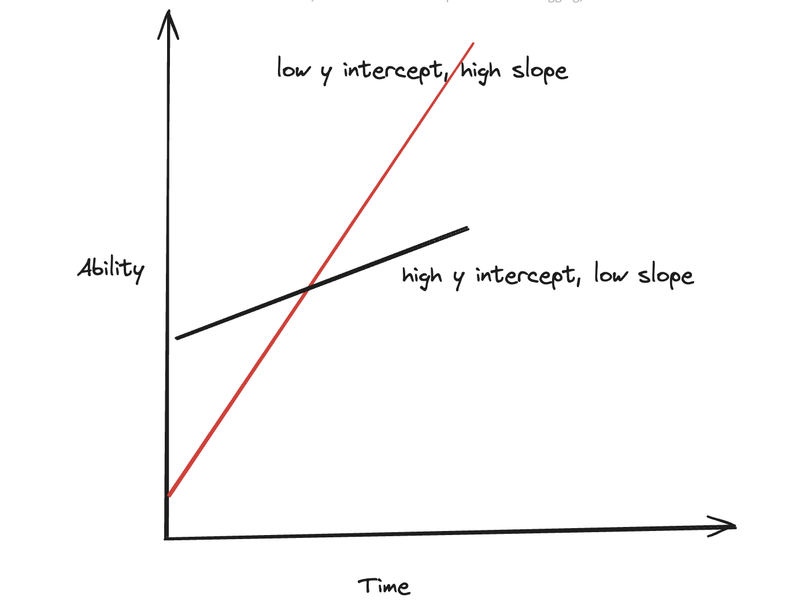

# Forward Deployed Engineers and how to hire them

Hiring multi-faceted people who can straddle the boundaries of technical and business problems can be a huge asset for organizations. I met and worked with many such people during my time at Palantir. I also hired a lot of them. This post is about learnings from my time at Palantir as a Hiring Manager for FDEs.

## What is an FDE?

A [Forward Deployed
Engineer](https://blog.palantir.com/a-day-in-the-life-of-a-palantir-forward-deployed-software-engineer-45ef2de257b1)
is a unique role that Palantir has. The linked blog post is a great intro to the role and what _a day in the life_ of an FDE looks like, but I want to share my perspective and my experience as an FDE, and an FDE hiring manager.

FDEs are generalist problem solvers with technical skills, with a focus on solving important problems. They are able to identify high value problem solving that will have immense business impact -- this requires strong business intuition as well as high user empathy. They are also unfazed by chaos and complexity. In fact, they thrive in environments where there is a lot of uncertainty. 

As you can imagine FDEs are notoriously hard to hire. As an interviewer, you are looking for someone who is not set in their ways, but has a high ability to learn and grow. This individual may not necessarily be super experienced -- in fact, in a lot of cases, they will be just starting. 

## How to hire them?

I usually think about hiring in terms of _Essentials_ and _Unforgivables_ - qualities that the candidate must have and absolutely should not have. 

**Essentials**:

- Outcome Oriented: Always keep the goal in mind, always seek to solve problems.
- Critical Thinker: Not afraid to question authority, and someone who can judge ideas on their own merits.
- High Chaos Ceiling: Doesn't struggle with ambiguity and chaos.
- Gritty: This isn't necessarily synonymous with hard worker, though there is a high correlation. Someone who isn't afraid to scale the mountain.

**Unforgivables**:

- Goes after the shiny thing: This is the opposite of outcome oriented. Someone who doesn't tie their work to impact.
- Passive: They tend to wait to be told what to do, and not seek out opportunities to solve problems.
- Entitled: High maintenance and high ego.

I have found that trying to understand where a candidate stands with these qualities is a good way to get a sense of whether or not they will be successful.

Some questions I ask to suss this out:

- How did you get from A→B→C and why? How was A→ B different than B→C , what would have happened if you went straight from A→ C?
- What is the hardest thing you have done/worked on/learned so far? Why was this hard for you?
- What was the hardest failure you have dealt with? Did you see it coming? How did you salvage the situation? Who did you ask for help?
- Tell me about a time when you proactively did something outside your day to day responsibility.

But at the end of the day it's about getting to know the person. Understanding what makes them tick, what keeps them going, and why.

## The Impact of FDEs

FDEs can be a highly impactful addition to your organization when hired correctly. Their ability to bridge technical solutions with real-world business challenges makes them invaluable in today's complex tech landscape.

FDEs have been a cornerstone of Palantir's success, acting as their "secret sauce" in delivering transformative solutions to their clients. Their versatility, coupled with their technical prowess and business acumen, allows them to drive significant value across various industries and problem domains.

However, identifying and hiring the right FDEs can be a challenging process. It requires a nuanced understanding of the role and a strategic approach to assessing candidates.

## Get in touch!

If you're intrigued by the potential of FDEs but find yourself struggling with the hiring process, I'm here to help. Whether you need advice on interview techniques, assistance in defining the role for your organization, or strategies for assessing candidates, feel free to reach out. 

Contact me at `me@anjor.xyz` to discuss how we can improve your hiring process and build a team of high-impact problem solvers. Let's work together to bring the transformative power of FDEs to your organization.

---

*Implementing an FDE hiring program? See my [FDE Advisory Materials](https://anjor.github.io/fde-advisory-materials/) for interview templates, scorecards, and detailed process guides.*