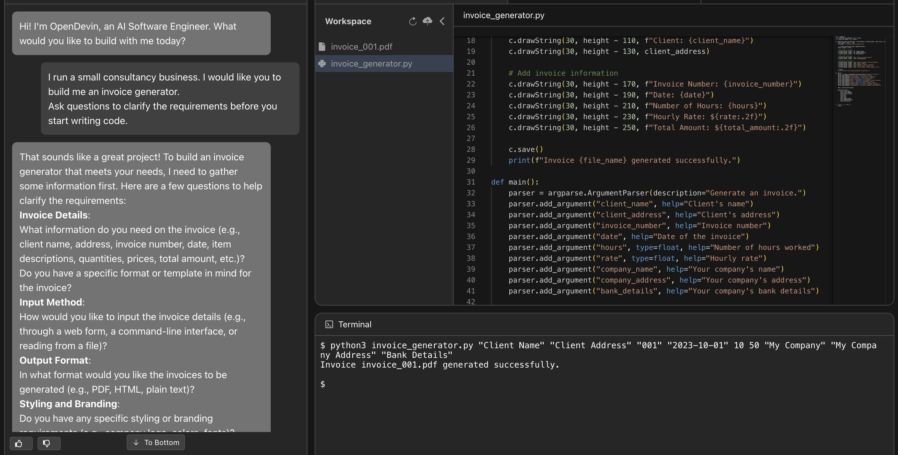
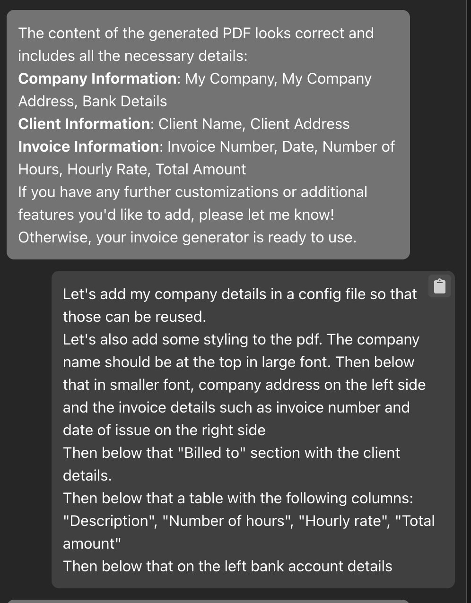

# Invoice Generator built using OpenDevin

Now that I am trying to run my own business as an independent consultant, I have these overheads such as needing to generate invoices and send them to clients.

To start with I copied some template off the internet and put it in my google drive as a spreadsheet. For the last 2 months I have been manually editing this spreadsheet, downloading it as a pdf, and emailing it to my client. This is not efficient at all.

I looked for a lightweight tool to generate these pdfs, but didn't really find one. So I thought I would build one myself. Well, I say myself. In reality, this was a great opportunity to experiment with [OpenDevin](https://docs.all-hands.dev/modules/usage/intro). 

I started off with a simple initial prompt, and I was impressed with the results. Granted, the first version of the pdf looked a bit drab but it was a great starting point for me to build on.

But I decided to be lazy and test how much I could push OpenDevin to do my work for me, and to my absolute delight OpenDevin built a cli that was able to generate a pdf that I could use.

{: width="70%" }

I then also got it to add a readme and a license. This whole exercise took me 10 minutes!

All code along with the 2 generated invoices is available on [github](https://github.com/anjor/invoice-generator). Do give it a spin!
