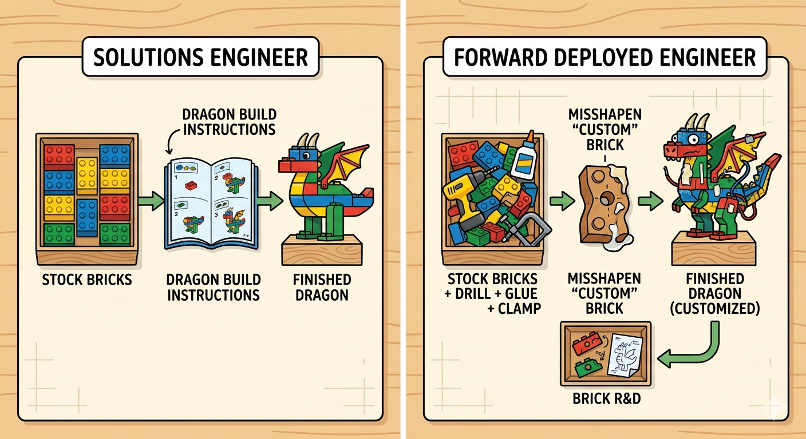
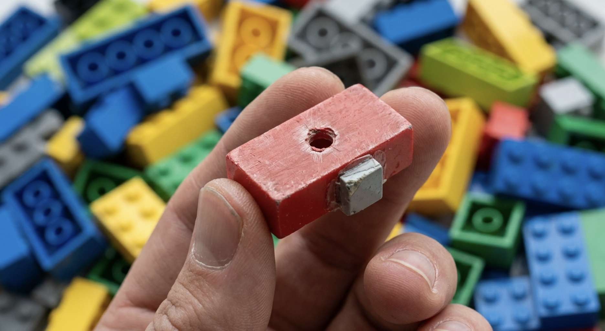

# If LEGO Had Forward Deployed Engineers

Forward Deployed Engineer is having a moment. Anthropic and OpenAI are pouring billions into the model. Lots of articles getting written about it. Founders are spinning up "FDE" titles before they've really worked out what the role does. And in nearly every conversation I have — with founders, recruiters, or curious engineers — the same question comes up: what actually makes an FDE different from a really good consultant?

Here's my attempt at explaining the role with a thought experiment.

## The customer wants a dragon

Imagine LEGO decides to spin up a Forward Deployed Engineering org tomorrow. The first customer walks in and says: *I want a dragon.*

You can solve that request two ways.

**The solutions engineer path.** A solutions engineer at LEGO has a beautifully organised inventory of every brick the company makes. They read the dragon brief, pick the right 287 pieces, write a clean instruction booklet, maybe even build the model themselves, and hand it over. The customer looks at it and goes, "Hmm — kind of looks like a parrot, but yeah, I can see the dragon. Thanks." Successful delivery. On to the next request.

**The forward deployed engineer path.** An FDE starts the same way, picking through the existing brick library — but they get stuck. There's no brick that gives them the right curve for the dragon's neck. The wing pieces don't articulate the way they need to. So they grab a brick, drill a hole through it, glue two together, sand a third one flat. They build a Frankenstein scaffolding of custom-modified pieces, and *then* they build the dragon.

The customer looks at the FDE's dragon and says, "Actually, I wanted a Lord of the Rings dragon, not a Zog from Julia Donaldson." Fine. The FDE iterates. More custom hacks. Eventually they hand over a dragon the customer actually loves.

The end state for the two paths look identical — both delivered a dragon. But the FDE has one more step, and that step is the entire point of the role.

## The step that makes it engineering

The FDE walks back to the LEGO brick R&D team holding a bag of weird, hacked-together bricks and says: "These are the pieces I had to invent to build that dragon. We don't make any of them. Should we?"

The product team looks at those custom bricks and decides what to do. Maybe they manufacture one of them as a new SKU. Maybe they don't manufacture any specific brick, but the patterns suggest they should build a *machine* that lets customers shape their own bricks. Maybe they conclude the dragon use case itself isn't worth investing in, but the technique unlocked something else entirely.

That loop — customer problem → bespoke build → product signal → real product — is the whole game. Without it, you are simply a very expensive consultancy in a t-shirt.

This is where the "E" in FDE earns its keep. A forward deployed engineer has to be technical enough to actually drill the hole, glue the bricks, build the thing. Otherwise the signal that comes back is mush. "The customer wanted a dragon and we couldn't build one" is useless. "The customer wanted a dragon, and the only way I could approximate it was by violating the structural integrity of these four standard bricks in this very specific way" is a product roadmap.

## Misaligned incentives, by design

The dirty secret of running a healthy FDE org is that the incentives between FDEs and product teams are deliberately misaligned.

The FDE wakes up every morning thinking: *how do I win this customer? What do I have to violate, hack, or hand-build to ship the dragon they want?* The product team wakes up every morning thinking: *what's the general abstraction that lets us serve a thousand customers without hand-building anything?*

Those two incentives pull against each other constantly, and the tension is genuinely uncomfortable. It's also where good product comes from. Collapse the tension by making everyone think like a product manager, and you stop getting customer signal. Collapse it the other way, by making everyone think like a delivery engineer, and you build Accenture. The job of leadership is to hold the rope taut.

One important corollary: FDE KPIs have to live at the company level, not the engagement level. The moment you start measuring revenue per engagement, your FDEs stop being product scouts and start being account managers. They optimise for charging more for the dragon. They stop bringing back the weird bricks. The healthier metric is something like *revenue per forward-deployed person, company-wide* — because the win isn't the FDE working harder on each engagement, it's the FDE identifying which bricks are worth productising, so that eventually customers' own engineers end up building dragons on top of those bricks while you collect licence fees. That's the flywheel. Engagement-level metrics short-circuit it.

## So what is an FDE?

If you take only one thing away: a Forward Deployed Engineer is a product R&D function dressed up as a delivery function. The deliverable to the customer is a dragon. The deliverable to *your own company* is the bag of weird bricks you had to invent to build it.

If no one is walking back to product with that bag of bricks, you don't have an FDE org. You have a really good services team. Both are valuable, both can be lucrative — but they're different jobs, and conflating them is how organisations end up confused about why their "FDEs" don't seem to be moving the product forward.

There's a wrinkle worth flagging, which I'll write up properly another time: AI keeps handing you new bricks. Claude Code, Skills, MCP servers, agent frameworks — the brick library itself is now powerful enough that a single engineer can build a credible dragon in an afternoon. As the bricks get more capable, the line between "forward deployed engineer" and "software engineer" starts to blur, and you have to ask whether you even need to productise the dragon at all, or whether the right move is to just keep delivering bespoke ones forever. That's a whole other topic.

For now, the LEGO test is enough: drill the brick, build the dragon, bring back the brick. That's the job.
