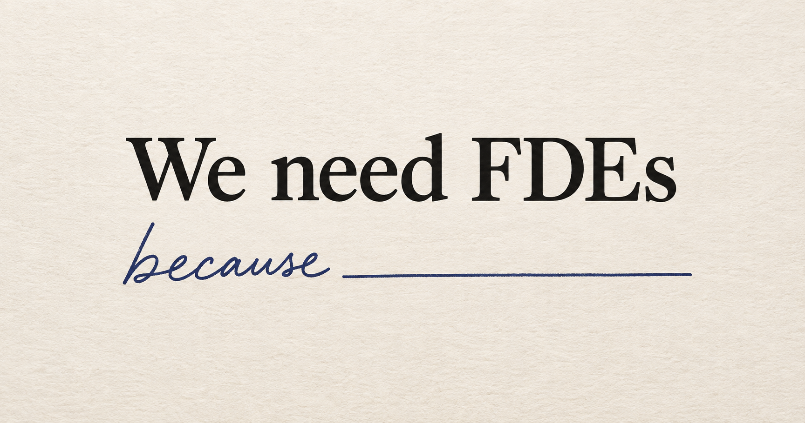

# "We need FDEs" is not a complete sentence

When a new client starts a conversation with “We need FDEs,” my next question is usually “What are you trying to achieve?”

Sometimes they need engineers who can get customers up and running on an existing platform. Sometimes they need people who can work out what the platform should be. Sometimes the difficult question is who takes responsibility for what they've built once the deployment team moves on. These lead to different conversations about whom to hire, how to organise the work, and what success looks like. Calling all of them FDEs doesn't resolve any of that.

FDE is an ill-defined role, and I think there is something valuable in that. At Palantir, I did backend development, data engineering, DevOps, sales engineering, and product management under the same title. The role emerged out of what the company was trying to achieve and what stood in the way. As the product evolved, the role changed too.

There was an interesting side effect of giving people such a broad title: you could do that thinking for yourself. Identify where you could uniquely add value, ideally somewhere you also found interesting, and go do it. This was one of the key things that made Palantir a great place to work at. 

On one deployment, the deployment strategist I worked with did a lot of the data pipelining while I focused on things breaking in the core product. When some of her Python code wasn't fast enough, I got involved in building a more efficient implementation. That division of work made sense for the two of us and the problem in front of us. Another pair would have divided it differently.

I often describe that partnership as being like two startup co-founders. One might be the CEO and the other the CTO, but both do whatever the company needs. The titles give you a rough idea of their strengths. They don't settle every question about who does what.

A friend of mine has a great definition of an FDE: someone who fixes broken shit. But to do that, you first have to identify the broken shit, diagnose why it's broken, and figure out how to fix it. Ideally, you leave behind something reusable. That might become part of the product, or it might be tooling that makes the next deployment easier. Otherwise, you just keep getting asked to fix the same broken shit over and over again.

That freedom needs a purpose. You don't have to know exactly what your FDEs will build before you hire them. Discovering that may be why you need them. But you do need some understanding of what you're trying to achieve, and you have to give them room to act on what they find. If they discover that the obstacle is in your product, can they help change it? If nobody will listen, their ability to diagnose the problem won't get you very far.

I've had to learn this in my own advisory work too. At one company, we started by helping existing solutions engineers take on more of an FDE role. Some of my assumptions from Palantir didn't fit the people and culture there. We had to look at who was taking to the changes, what was actually working, and where we needed to adjust. We narrowed the effort to a few people and a more limited scope, with the idea of getting that working before expanding it.

The people you already have matter. So does the state of your product, the ambition of the company, and what you're willing to change. You can learn from how Palantir did it, but you still have to work out what makes sense for you. And then keep adapting as you learn.

“We need FDEs” is a perfectly reasonable place to start a conversation. Before it becomes a job description, though, we need to finish the sentence.
