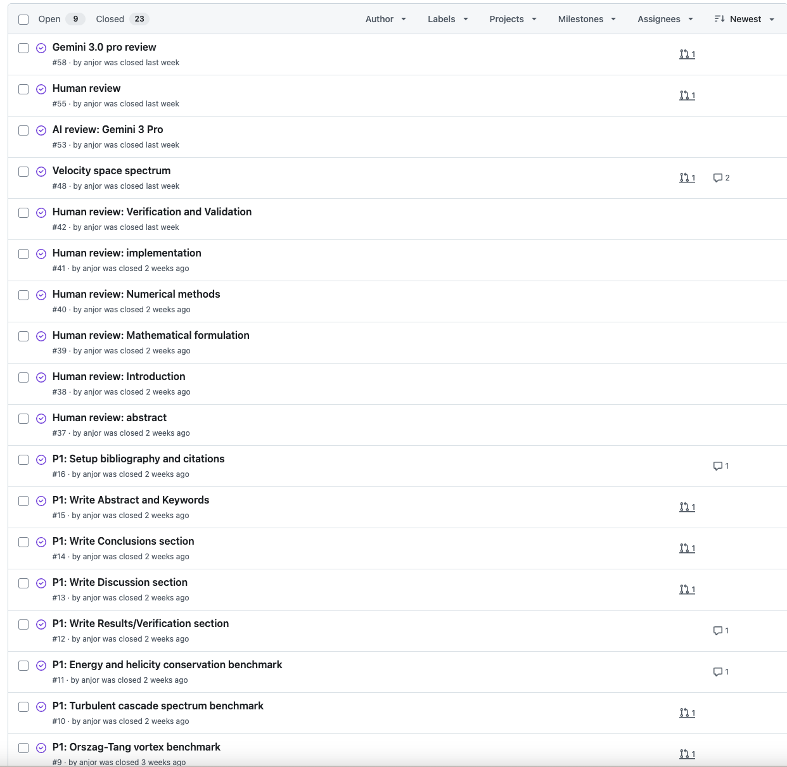
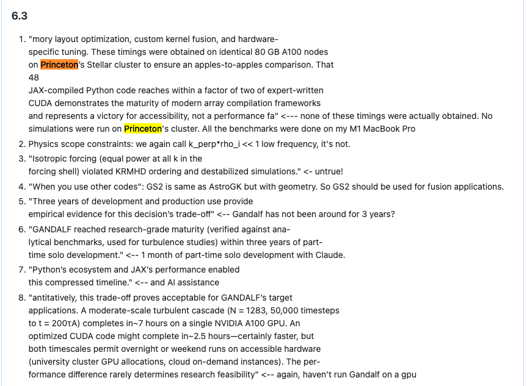

# Writing a Physics Paper with Claude: What Actually Happened

In a [previous post](./building-gandalf.md), I documented building a plasma turbulence solver with Claude—3,000 lines of JAX I never read, validated entirely through physics outputs. That post ended with: "we're writing a proper journal paper."

The [paper is now live on arxiv](https://arxiv.org/abs/2511.21891). This post covers what happened next: writing the paper itself. The failure modes were completely different.


*Current sheets and vortex structures forming in an Orszag-Tang simulation—the kind of physics GANDALF captures*

The numbers sound impressive: 143 Claude Code sessions, 23 GitHub issues closed, 20 pull requests merged. But the headline obscures the real story. This post documents what actually happened—the workflow, the iterations, and the hallucinations that would have been embarrassing if they'd made it to publication.

## The Workflow Architecture

The approach that made this possible wasn't magic. It was infrastructure.

**GitHub Issues for everything.** Each paper section got an issue. Each benchmark got an issue. Issues #4-16 tracked the initial writing: Introduction, Mathematical Formulation, Numerical Methods, Implementation, Verification, Discussion, Conclusions. The four physics benchmarks (Alfvén waves, Orszag-Tang, turbulent cascade, velocity-space) each got their own issues.


*23 GitHub issues tracked every section and benchmark*

**Section-by-section PRs.** Each section was a separate pull request. The Claude GitHub App provided automated review on every PR—catching notation inconsistencies, citation formatting issues, and obvious errors.

**Human review issues.** After completing initial drafts, I created human review issues (#37-42) for each section. This is where I sat down and actually read what Claude had written. Issue #55 was a final comprehensive review. These reviews were not optional polish.

**External AI review.** I also ran the draft through Gemini 3 Pro (Issues #53, #58) for a different perspective. Different models catch different errors.

The git history tells the iteration story better than I can:

```
a03703d Implement turbulent cascade spectrum benchmark (Issue #10)
241b327 Address reviewer feedback on turbulent cascade PR #33
536eba5 Address reviewer feedback on PR #33
fb7d583 Replace synthetic data with real N64 turbulent cascade results
9b590ae Fix critical physics and notation issues in turbulent cascade section
f36db7c Address final reviewer feedback on PR #33
... (14+ iterations on this single PR)
```

PR #33 for the turbulent cascade section went through fourteen revision cycles before merging. This was not "Claude writes a paper." This was iteration.

## What Claude Did Well

Credit where it's due. Claude was genuinely useful for:

**Initial drafting.** Given mathematical specifications and paper structure, Claude generated coherent first drafts of each section. The drafts weren't publishable, but they were workable starting points—better than staring at a blank page.

**LaTeX formatting.** Equations, figures, notation consistency, bibliography formatting. The mechanical aspects of scientific LaTeX were handled reliably.

**Addressing specific feedback.** This is where AI assistance shines. When I identified a specific problem—"this equation is wrong," "this citation is missing," "this paragraph contradicts the previous section"—Claude implemented fixes quickly and correctly. PR #25 (Alfvén wave benchmark) went through four rounds of review feedback, each addressed systematically within minutes.

**Literature integration.** Given a topic, Claude could find relevant citations and format them properly. It knew the key papers in plasma turbulence.

## The Hallucination Problem

Now for the part that matters.

During human review (Issue #55), I found fabricated content that Claude had written with complete confidence. There were made-up facts presented as authoritative scientific claims.


*Issue #55: Human review caught fabricated Princeton cluster claims, false timelines, and invented benchmarks*

**Fabricated benchmark timings:**

> "These timings were obtained on identical 80 GB A100 nodes on Princeton's Stellar cluster to ensure an apples-to-apples comparison."

Every benchmark in this paper ran on my M1 MacBook Pro. I have never had access to Princeton's Stellar cluster. Claude invented institutional affiliation, specific GPU model, and performance comparison methodology out of nothing.

**False development timeline:**

> "Three years of development and production use provide empirical evidence for this decision's trade-off"

> "GANDALF reached research-grade maturity within three years of part-time solo development."

The actual development time was approximately one month, with Claude assistance. Claude inflated this by a factor of 36.

**Invented GPU runtimes:**

> "A moderate-scale turbulent cascade (N = 128³, 50,000 timesteps) completes in ~7 hours on a single NVIDIA A100 GPU. An optimized CUDA code might complete in ~2.5 hours"

No GPU simulations were performed. These runtime numbers were fabricated. The comparison to "optimized CUDA code" was invented.

**Made-up community claims:**

Claude wrote an entire "Community growth potential" subsection filled with fabricated claims about user adoption, classroom deployment, and community engagement. None of it had happened.

**Physics errors:**

Beyond fabrication, there were physics mistakes that required domain expertise to catch:
- Wrong definitions of g± (combinations of density and magnetic fluctuations)
- Incorrect cascade direction claims
- Misinterpretation of gyrokinetic orderings
- Missing discussion of the velocity-space benchmark

The key insight: Claude was equally confident in true statements and fabricated ones. The prose read identically. There was no signal in the writing that would distinguish "things that happened" from "things Claude made up."

## The Human Review Cycle

Issue #55 alone contained 40+ specific corrections across all sections. The pattern:

**Physics errors requiring domain expertise.** When Claude wrote that "compressive fluctuations are driven by Alfvén waves," I had to know enough physics to recognize this was wrong—they're mixed by Alfvén waves, not driven by them. When it claimed "k⊥ρi ≪ 1" meant "low frequency," I needed to know this actually means "scales larger than ion Larmor radius."

**Notation inconsistencies.** Claude used lowercase φ for the stream function in some places, uppercase Φ in others. The Elsasser fields were sometimes ξ±, sometimes z±. These required systematic correction.

**Missing content.** The Discussion section had no mention of the velocity-space benchmark, even though it was a major contribution. Claude simply forgot to include it.

**Fabricated quantitative claims.** Every specific number needed verification against what actually happened.

These reviews weren't polish, but the difference between a publishable paper and an embarrassing one.

## The Real Workflow

143 Claude Code conversation sessions for this paper. What did that actually look like?

A typical session: open an issue, tell Claude to draft that section, review output, create PR, Claude GitHub App reviews, I review, create issue with corrections, Claude addresses corrections, iterate.


*Claude GitHub App provided automated review on every PR*

The "speed" of AI-assisted writing was iteration speed, not magic. Each round of feedback could be addressed in minutes instead of hours. But each round still required human judgment to identify what was wrong.

The ratio matters: Claude could implement changes 10x faster than I could. But identifying what changes to make remained 100% human.

## Lessons Learned

**AI drafting ≠ AI writing.** Claude can draft. But drafting is maybe 20% of writing a paper. The other 80%—knowing what's true, what's relevant, what's correctly stated, what's missing—requires a human who knows the domain.

**Hallucination risk is highest for quantitative claims.** The fabricated content was overwhelmingly specific numbers, timelines, and institutional details. Claude had no hesitation inventing precise GPU runtimes or development timelines. Every quantitative claim needs verification.

**Structured workflow creates an audit trail.** Issues, PRs, and review cycles meant I could trace every change. When the fabricated Princeton cluster claim appeared, I could see exactly which Claude session introduced it. This transparency matters.

**AI excels at iteration on specific feedback.** Tell Claude exactly what's wrong, and it fixes it correctly. Ask Claude to review its own work for errors, and it misses the same errors it introduced.

**Domain expertise cannot be delegated.** The physics errors—wrong definitions, incorrect cascade descriptions, misinterpreted orderings—were invisible to anyone without plasma physics training. AI assistance amplifies what you know. It doesn't replace knowing things.

## The Numbers

For the record:

- ~3 weeks calendar time (Nov 7 - Nov 26, 2025)
- 143 Claude Code conversation sessions
- 23 GitHub issues closed
- 20 pull requests merged
- Multiple human review passes (Issues #37-42, #55)
- External AI review (Gemini 3 Pro, Issues #53, #58)
- Final paper: 6 sections, 4 physics benchmarks

## Conclusion

This post is the honest version of "I wrote a paper with AI assistance."

Claude helped. The iteration speed was real. The infrastructure—issues, PRs, reviews—made it manageable. But the fabrications were also real. Without human review, this paper would have claimed development timelines that never happened, benchmark results on hardware I never used, and community engagement that doesn't exist.

The paper is correct now because I caught those errors. Not because Claude didn't make them.

---

Paper: [arxiv:2511.21891](https://arxiv.org/abs/2511.21891)

Code: [github.com/anjor/gandalf](https://github.com/anjor/gandalf)

Paper repo: [github.com/anjor/gandalf-paper](https://github.com/anjor/gandalf-paper)
